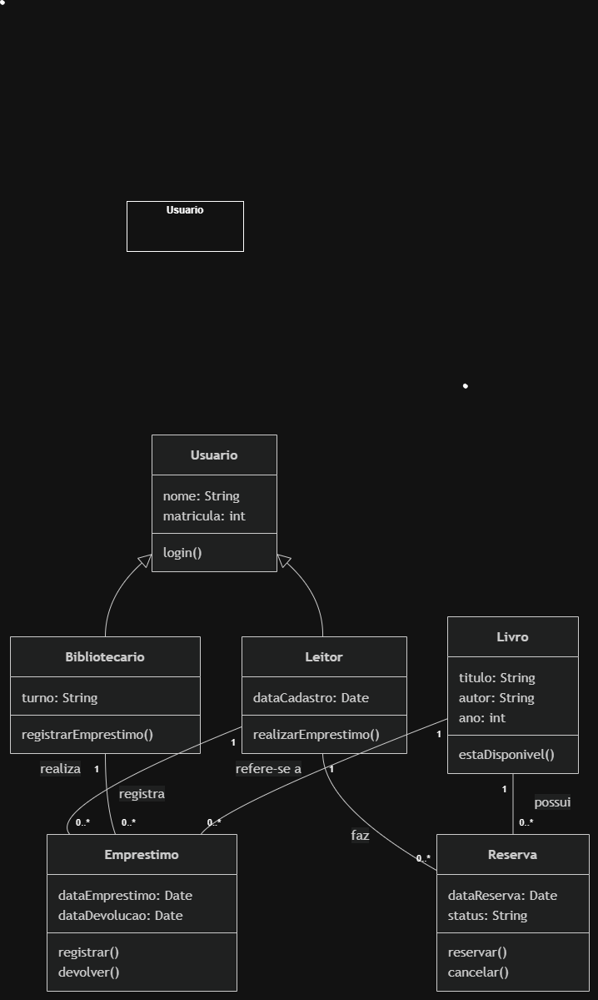

# Atividade 18 — Diagrama de Classes do BiblioTech

Nome: ALCIDES DINIZ VEIGA
Turma: 2º ano — Técnico em Informática Integrado

## Diagrama

## Por que escolhi esses números

- Coloquei 0..* perto de Emprestimo porque um bibliotecário pode registrar vários empréstimos.
- Coloquei 1 perto de Bibliotecario porque cada empréstimo é registrado por um bibliotecário.

## Rastreabilidade

- A operação registrarEmprestimo() da classe Bibliotecario está relacionada ao caso de uso Emprestar Livro.

## Autoavaliação

- Conceito que pretendo: B
- Isso aparece no diagrama pelas classes, pelas ligações, pelas multiplicidades, pela herança de Usuario e pela classe Reserva.